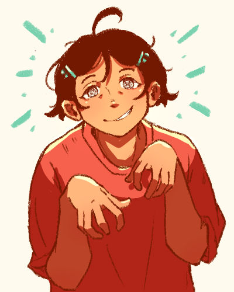
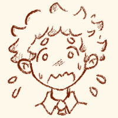

:material-ghost-outline: Ein
========================
{ .profile-img }

## Profile { .underline }

Full name is 桂珲 (Gui Hun). An art school dropout that has returned to their childhood home in Bandar Esok after 9 years abroad. 

**Also known as**: 阿珲 (by 蕾)

**Status**: Alive

**Species**: Human

**Name pun** : (full chinese name) 鬼魂 - which means 'ghost' or 'spirit'. 

---

## Appearance { .underline }

Has short black hair with their fringe parted in the middle, the two sides are held by a pair of jade coloured dragonfly clips. There is one strand of hair in between the parting. 

They have black eyes with irises that look like tv-static. Both eyes have slight eyebags underneath.

Usually wears a red t-shirt, dark jade coloured shorts, and a pair of red jandals.

---

## Personality { .underline }

Quiet and uncomfortable in large groups. Used to be loud and attention-seeking when they were younger.

Is mischievous and silly when alone.

Has a hard time making friends. They're lonely but also afraid of needing to change for other people.

Tends to view their childhood with rose tinted glasses. Is quite stubborn when it comes to beliefs they grew up with.

### Likes

- Fried Shrimp Rolls
- Chinese New Year
- Their bedroom

### Dislikes

- Drawing or anything "too creative".
- Being reminded of their declining chinese fluency.
- 'Milestones of Maturity' - getting a job, buying a house, settling down, having kids etc.
- Ambition

### Hobbies

- Wandering in town (like a ghost)

---

## History { .underline }

Ein left Bandar Esok 9 years ago and migrated to New Zealand with their family, giving their old family home to [蕾](1lei.md). Ein still kept in contact with 蕾.

Ein could not adapt to life in a foreign country. No one looked like them, no one spoke like them. No matter how long they stayed, they felt like a perpetual outsider. They resisted the pressure to adapt to their new environment, in fear that they'll have to destroy a part of themself in exchange.

Ein has been texting 蕾 throughout.

On their last year in art school, Ein has a mental breakdown and dropped out. This disappointed everybody who found out, except 蕾, whom at this point is Ein's only friend.

One day, 蕾 offers Ein a place to live in their old childhood home. Ein immediately agrees and makes their way back.

Ein gets caught up in the town's curse and finds out about 蕾's condition.

---

## Desire { .underline }

- To relive childhood
- To be friends with [幻颖](1huan-ying.md)

---

## Fear { .underline }

- Change
- Losing childhood memories.

---

## Relationships { .underline }

### [蕾](1lei.md)

Ein's cousin. Briefly lived in Ein's childhood home when Ein was in primary school, but now owns the house. Revealed thier undead condition to Ein.

{ .skrunkle-img }

### [幻颖](1huan-ying.md)

They met on the train Ein took to get to Bandar Esok. 幻颖 returned a bag Ein left on the train. Ever since, Ein wants to be friends with them. Ein sees them as a fellow outsider.

They try not to involve Ein in their mission, but is surprised at how they always meet at the most inconvenient times.

### [蕙伊](1hui-yi.md)

Invited Ein into their store one time after seeing Ein wandering in front of their store. The two of them have a casual friendship. Ein finds their relaxed attitude and lack of ambition comforting and safe. 

They often give Ein tips on where to find 幻颖.

### 年兽    

Like the other residents of Bandar Esok, [Ein is under their influence](../Snippets/restoran-laut-brainstorm.md#The%20story), afflicted with the curse of eternal celebration.

---

## Misc.

- They're english name 'Ein' comes from the protagonist of [Riviera: The Promised Land](https://en.wikipedia.org/wiki/Riviera:_The_Promised_Land), which is one of my favourite games. 
- Ein used to be called Einar, but I think Ein sounds cuter.

