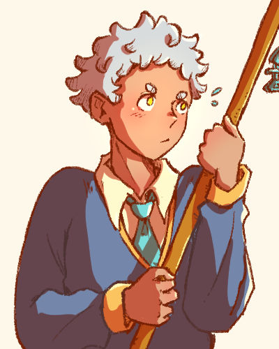

:material-broom: 幻颖
========================

{ .profile-img }

## Profile { .underline }

幻颖 (Huan Ying). A civil worker sent from the deep-sea to bring back a missing resident - the 年兽, along with 蕙伊. Takes their job very seriously. Incapable of speaking fluently.

**Also known as**: 颖颖 (by 蕙伊), 阿幻 (by 蕙伊)

**Status**: Alive

**Species**: Deep-sea resident

**Name pun**: 幻影 - which means 'phantom' or 'illusion'

**Affiliation**: [剩鱼厅](../Locations/souvenir-shop.md)

---

## Appearance { .underline }

Has short messy white hair and yellow eyes. Their eyebrows are almost like little circles. 

In their human form, their ears are rounded and their sclera are white. In their natural form, their ears are long and pointed and their sclera are black, with gills down their neck.

They are usually in a white shirt underneath a dark blue and gold sweater, with a teal tie and brown checked pants. When they are helping out at 剩鱼厅, they wear a waist apron.

They always have their broom in hand. The broom has a fish bone charm made by 蕙伊 attached to the top。

### Design Notes

- Small irises - Narrow focus, one track mind

---

## Personality { .underline }

Diligent and will always see a job through. Can't stand the idea of loose ends. 

Doesn't have much self-confidence and sees their diligence as their only asset.

[Likes feeling unique.](../Snippets/restoran-laut-brainstorm.md#%E5%B9%BB%E9%A2%96%20and%20%E8%95%99%E4%BC%8A)

### Likes

- Prizes
- Their broom
- Sandwiches and wraps

### Dislikes

- Laziness
- Broken promises
- Talking

### Hobbies

- Doing household chores
- Sitting on roofs
- Journalling

---

## History { .underline }

A civil servant in the deep-sea working in the Missing Persons Department. They were usually deployed locally, but were sent to Bandar Esok for this particular mission. 幻颖 was always employee of the month. 幻颖 kept their head down and never talked back, earning their superior's favour.  Because of their outstanding performance record, they were always partnered with the underperfoming 蕙伊. 

幻颖 couldn't adapt to [Bandar Esok](../Locations/bandar-esok.md) and avoided interaction with the residents, making their mission much more difficult.

---

## Desire { .underline }

- Being accepted as themself.
- Validation from their superiors, [receiving a badge of honour for their service.](../../ideas/failure/prizes.md)

---

## Fear { .underline }

- Being unloved

---

## Relationships { .underline }

### [蕙伊](1hui-yi.md)

Mission partners. Given how often they'll be together, they decide it would be more convenient of they were seen as siblings during the mission.

幻颖 is often annoyed by 蕙伊's lack of enthusiasm toward their work, despite their capabilities. 蕙伊 often let 幻颖 take most of the credit for successful missions, saying that they want to "avoid the boss' attention". This gives 幻颖 mixed feelings.

Despite having many gripes with them, 幻颖 works well with them and relaxes around them. 幻颖 even helps them out with their souvenir store - [剩鱼厅](../Locations/souvenir-shop.md), which has nothing to do with the mission.

{ .skrunkle-img }

### [Ein](1ein.md)

Met on a train 幻颖 was investigating. 幻颖 returned a bag Ein left on the train. Ever since, 幻颖 keeps coincidentally bumping into them. 幻颖 thinks it might be part of the 年兽's doing.

幻颖 understands that Ein is trying to befriend them, but is reluctant to open up because they can't rationalise it.
> 'Why would they want to be my friend? I can't think of a single reason.'

As they keep meeting and interacting more, 幻颖 starts to soften up to them.

### [年兽](beast.md)

幻颖‘s mission target.

幻颖 is frustrated by the 年兽, they believe that the beast is influencing and altering the town. 幻颖 spends a significant amount of time trying to clean up its 'messes'.

---

## Misc

- I created 幻颖 during my semester 1 project in my final year of art school. It was during the pandemic and I had just started doing digital art. This make them one of my oldest surviving OCs. 
    - In that project, they were an unnamed detective with an invisible miasma surrounding them. Whenever they tried to speak, the miasma would choke them. They also had a large scarf that covers their mouth.

