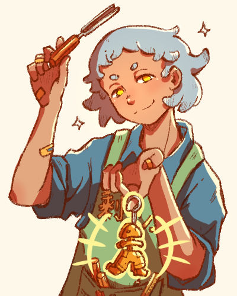

:material-hammer-screwdriver: 蕙伊
========================

{ .profile-img }

## Profile { .underline }

蕙伊 (Hui Yi). A civil worker sent from the deep-sea to bring back a missing resident - the 年兽, along with 蕙伊. Has no intention to complete their assigned mission.

Is the proprietor of 剩鱼厅 - a souvenir shop that sells wooden carvings. They carve all the products themself, despite their lack of skill. Gets along with people easily.

**Also known as**: Boss (by Ein)

**Status**: Alive

**Species**: Deep-sea resident

**Name pun**: 回忆 - which means 'memory'

**Affiliation**: [剩鱼厅](../Locations/souvenir-shop.md)

**Theme**: Freedom

---

## Appearance { .underline }

蕙伊 has a bob with two hair pieces sticking out on each side, resembling horns. Their fringe is cut short. They have circle eyebrows.

They're usually in a blue button-up with the sleeves rolled up to their elbows, and a pair of brown cargo pants. They always have their green work apron on when not at home, stuffed with woodworking tools and branded with "剩鱼厅".

> "You never know when inspiration will strike! ...Plus it's good advertisement!"

---

## Personality { .underline }

Easygoing and gets along well with people. Doesn't sweat the small stuff. Loves getting to know others and learning about new perspectives.

Their curiosity leads to alot of hobbies and interests. The contents of  剩鱼厅 often reflect whatever their current obsession is.

Is also rather fickle, unwilling to do anything that they deem "boring". Doesn't want to be tied down by commitment.

### Likes

- Naps
- Getting to know people
- Rice ("You can pair them with so many dishes!")

### Dislikes

- Authority figures
- Being told what to do

### Hobbies

- Changes every few weeks
- The only enduring hobby is woodworking (they are terrible at it though...)

---

## History { .underline }

A civil servant in the deep-sea working in the Missing Persons Department. They were usually deployed locally, but were sent to Bandar Esok with 幻颖 for this particular mission. 蕙伊 has been in the department much longer than 幻颖. They used to be a top performer at their job, excelling at investigation and information gathering, but their performance started to decline when they got bored of the work. 蕙伊 is frustrated because they can't quit, as their boss threatened to blacklist them and prevent them from getting any other job.

Using this mission as their lucky break, they decide to make a living in Bandar Esok, setting up a souvenir shop. 蕙伊 picked up woodworking, using local materials to make their products. Though the shop had no customers at first, business starts to pick up as they formed connections with the locals.

蕙伊 has no intention of returning to the deep-sea.

---

## Desire { .underline }

- Freedom

---

## Fear { .underline }

- Commitment
- Responsibility

---

## Relationships { .underline }

{ .skrunkle-img }

### [幻颖](1huan-ying.md)

Mission partners and "siblings". Mission siblings.

Despite not being interested in the assigned mission, 蕙伊 often helps 幻颖 work through clues and observations. They feel comfortable around each other and have alot of mutual trust.

蕙伊 is grateful that 幻颖 is supportive of their business and helps out.

{ .skrunkle-img }

### [Ein](1ein.md)

Casual friends. 蕙伊 finds it interesting how Ein is not as affected by the curse compared to the other locals. 

Helps Ein make friends with 幻颖。

### [年兽](beast.md)

蕙伊 is apathetic towards them. 

---
 
## Magic

### Imbue memories

When carving, 蕙伊 is able to imbue particular memories into the object. When someone holds the imbued object, they get the surrounding feelings of the memory, rather than the memory itself entering their head. It's like that feeling in your chest when you think about your childhood bedroom or grandparents' house.

蕙伊 would often imbue memories they uncover from the locals in the products in the store. This is why people buy things here despite 蕙伊 lack of woodworking skills.

Custom souvenirs are a popular service in the store, where 蕙伊 would sit down and have a chat with the customer while carving.

---

## Misc.

- 蕙伊 used to have Ein's fringe. I gave Ein their fringe because Ein's hair looked too much like [Handa from Barakamon](https://barakamon.fandom.com/wiki/Sei_Handa) (one of my favourite manga).

