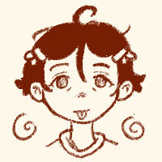

:material-timer-pause-outline: 蕾
========================

{ .profile-img }

## Profile { .underline }

Full name is 桂蕾 (Gui Lei). Ein's older cousin and lives in the same house.

**Also known as**: 阿蕾, Lei

**Status**: Undead

**Species**: Doll

**Name pun**:  傀儡 - which means puppet

**Affiliation**: [绘声社](../Factions/storytelling-club.md)

---

## Appearance { .underline }

蕾 is 185cm tall. They have long hair that is usually tied in a loose side ponytail. Often wears polo shirts paired with basketball shorts. They wear a jade bracelet with a pen nib charm on their left wrist, it was a gift from Ein.

### Design notes

Their center fringe is meant to look like the paper talisman （符籙 fulu) of a 僵尸。

---

## Personality { .underline }

Gentle and pleasant to talk to. Has a good intuition when it comes to finding the right words to say. Is aware of their "gentle giant" image and tends to lean into that, even at the cost of their true feelings.

Has a tendency to lie in order to maintain their image, saying what people want to hear. Mentally berates themself whenever they give in to the impulse. Has major impostor syndrome.

### Likes

- Butter prawns
- Huat Kueh
- Watching costume dramas

### Dislikes

- Cars
- People going through their stuff without permission

### Hobbies

- Playing Mahjong
- Painting

---

## History { .underline }

They used to work as a journalist. Four years before Ein moved back in, 蕾 was involved in a car accident while driving to submit a manuscript. The next thing they knew, they woke up in the [eel clinic](../Locations/eel-clinic.md) naked, they are in a doll version of their body. After the eel nurses "complete" them, they were kicked out of the clinic and the entrance disappered.

When 蕾 returned to the accident site, it had already been cleared out. Cars were driving over the site like it never happened. 

> "I saw my accident in the newspaper, they even included my face! But, for some strange reason, no one seemed to care. Not even when I seemingly came back to life."

> "I tried to get back into my usual routine, but I started to realise that my body wasn't completely the same. I had alot of trouble with simple everyday things. Even got fired because I struggled to write.

They stuggled to adapt until meeting a member of the 绘声社, a group a similarly "resurrected" people. Through the help of their club members, 蕾 got to know more about their ["symptoms"](../Factions/storytelling-club.md#symptoms).

蕾 couldn't decide whether to confide in Ein about their situation, but [Ein eventually found out and accepted 蕾 for who they are](../Snippets/%E5%9B%9E%E4%B9%A1summary.md).
 
---

## Desire { .underline }

- To be human

---

## Fear { .underline }

- Losing their memory, thus their identity
- Being "found out"

---

## Relationships { .underline }

{ .skrunkle-img }

### Ein

蕾’s cousin. Due to Ein's time away before moving back, 蕾 can't actually see how Ein looks like anymore. Nevertheless, they still have a close and comfortable relationship. 蕾 deeply treasures their famlial connection.

蕾 tries their best to call Ein by their new english name rather than "阿珲". Is motivated to keep thier lying impulses under control for Ein's sake.

### Design note
Serves as a contrast to Ein -  Ein yearns to return to the past; Lei has no choice but to live in it.

