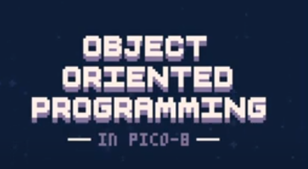

:material-code-block-braces: [OOP](../../webdevNotes/oop.md) in PICO-8
========================

## Star field example




[Object Oriented Programming in PICO-8 video by Kevin Makes Games](https://www.youtube.com/watch?v=X9qKODb-wXg&list=PLOnz_5SBywID2Gp5pqUr1_pvWI9ajOi7z)

They also made a [github repo](https://github.com/kevinthompson/object-oriented-pico-8) for the video example.

The lua progamming language is actually pretty similar to javascript. I could follow the login pretty easily. I think i could apply this class inheritance structure to my js projects!

### Tables

[Tables in lua seem to be similar to objects in js](https://www.lua.org/pil/2.5.html)

[Quote from sdegutis in HackerNews:](https://news.ycombinator.com/item?id=17970138)

> "Lua tables are semantically almost identical to JavaScript objects. The one key difference is that any object can be a key in a Lua table, whereas all JS object keys are coerced into strings. The other more minor difference is that you use getmetatable() and setmetatable() instead of modifying or setting object.__proto__"

---

### _ENV

[Using _𝘦𝘯𝘷 in PICO-8](https://www.lexaloffle.com/bbs/?tid=49047)

> "..._𝘦𝘯𝘷 itself is just a local identifier in your current scope, and like any other identifier you can assign anything to it. In particular, you can overwrite the automatically created _𝘦𝘯𝘷 in your current scope, which will always be the GLOBAL ENVIRONMENT, and point it to any table, and from that point on, any free name will be looked for inside that table and not in the _𝘦𝘯𝘷 scope originally received ."

It's interesting how you can change the current "global" environment.

"self" in lua seems to be the similar to "this" in js

putting _ENV as a parameter in a table function will make the current table act as the global environment throughout the function's execution. You don't need to add self. in front of variable names, saving tokens.

```
update=function(self)
    self.y+=self.spd
    
    if self.y-self.rad > 127 then
        self.y=-self.rad
    end
end
```
turns into...

```
update=function(_ENV)
    y+=spd
    
    if y-rad > 127 then
        y=-rad
    end
end
```

When the function finishes executing, the global environment will return to normal.

---

### Metatables and the __index metamethod

i like the word metatmethod

[Metatables are sort of like prototypes.](https://www.lua.org/pil/13.html)

> "Any table can be the metatable of any other table; a group of related tables may share a common metatable (which describes their common behavior); a table can be its own metatable (so that it describes its own individual behavior). Any configuration is valid."

[JS equivalent of __index is proxy() ? (need to read up a bit more)](https://stackoverflow.com/questions/1642167/do-javascript-prototypes-have-something-equivalent-to-luas-index-newindex)

snippet from the stackoverflow answer - 

> --Lua code
```
local o = setmetatable({},{__index=function(self,key)
  print("tried to undefined key",key)
  return nil
end
```
> //With Proxy in Javascript
```
let o = new Proxy({}, {
    get: function (target, key, receiver) {
        if (!target.hasOwnProperty(key)){
            console.log("tried to undefined key "+key);
        }
        return Reflect.get(target, key, receiver);
    },
    set: function (target, key, value, receiver) {
        console.log(`set `+ key);
        return Reflect.set(target, key, value, receiver);
    }
})
```
> get : __index
> set : __newindex


